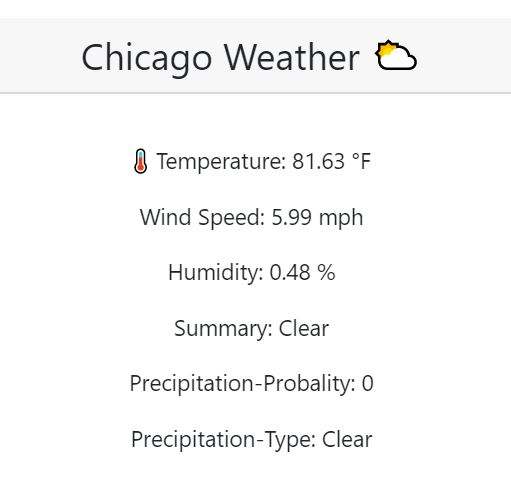

# team6-project1  -  WHATS UP CHICAGO
*   What's Up Chicago PAGE (index.html)

*   WELCOME PAGE (index1.html)
*       simple slideshow / welcome portion --> links to out main webpage/our footer links to the newsletter
*       kept it simple before showcasing the main goods
*       linked to firebase to view amount of clicks + users entering our site

*   MAIN WEB PAGE (index1.html)
*       slideshow header --
*       first link to our newsletter (if people want to sign up)
*       next, we display the weather (using the Dark Sky API)
        
*       we have a static button that links to the weather.com site for people to view weather ahead of time instead of just    the current
*       next, we display restaurants. 4 components: 1) static buttons leading to opentable and resy for people to make reservations to their favorite places. 2) "our teams" top picks for the week -- also static, but makes it personal + we place our reccommendations. Each restaurant also links to that main website. 3) restaurant search display (using YELP API) -- you search a cuisine and it displays the top 10 restaurants for that specific search 4) another static div that displays "this week's featured restaurant" -- again, for a personal touch and branding
*       next, we have our events display -- we are using the eventful API. 
*       we have 4 categories: sports, concerts, theatre, and comedy. Once you click a category, the events FOR THE WEEK ONLY are displayed underneath. once you choose a different category, it clears out your old search and displays the new!
*       next, we have a few more static content -- just displaying "our teams monthly finds" around the city. Each button links to that company's website -- personal touches and branding.
*       THEN, we have our GOOGLE MAP API -- with multiple markers: they are pointed to main attractions in the city: art institute, willis tower, chicago center, navy pier, etc etc)
*       THEN, using iframe, we have added a chicago summer calendar of events to display on our site. You have the option to add the events to your google calendar too using the button.

*   NEWSLETTER (newsletter.html)
*      connected to our firebase -- to store data from user input
*      people can sign up for our newsletter. we just need name, email, and we have a comments section.
